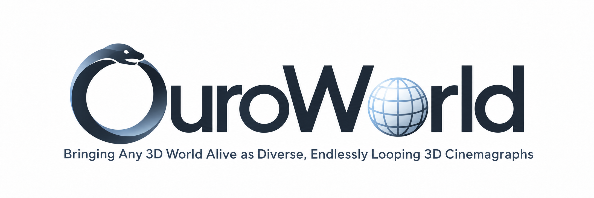
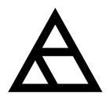
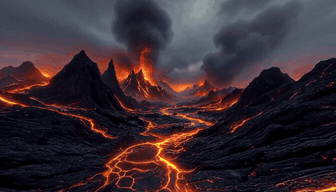
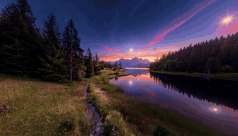

<p align="center">
  
</p>

# OuroWorld

**Bringing Any 3D World Alive as Diverse, Endlessly Looping 3D Cinemagraphs**

<p align="center">
  <a href="https://www.youzhexie.me/">You-Zhe Xie</a><sup></sup>,
  <a href="https://profile.userwei.com/">Ting-Wei Chou</a><sup></sup>,
  <a href="https://www.yhlizzz.com/">Yu-Hsuan Li</a><sup></sup>,<br>
  <a href="https://kpzhang93.github.io/">Kaipeng Zhang</a><sup></sup>,
  <a href="https://lightchaserx.github.io/">Zhixiang Wang</a><sup>&dagger;</sup>,
  <a href="https://yulunalexliu.github.io/">Yu-Lun Liu</a><sup>&dagger;</sup>
</p>
<p align="center">
   National Yang Ming Chiao Tung University &nbsp;&nbsp;  Alaya Lab<br>
  <sup>&dagger;</sup> Corresponding authors
</p>

[](https://ouroworld.userwei.com)
[](#)
[](#)
[](https://huggingface.co/datasets/YouZhe/OuroWorld-dataset)
[](https://github.com/youzhe0305/OuroWorld)
[](mailto:youzhe0305.cs12@nycu.edu.tw)

OuroWorld turns a static 3D Gaussian Splatting (3DGS) scene from any source
(a reconstruction, or a 3D world model such as HY-World 2.0, Marble or
Lyra 2.0) into a *3D cinemagraph*: a dynamic scene with vivid, diverse motion
that loops endlessly and can be viewed from moving cameras. It is mask-free
and captures general deformation, object motion and illumination change, not
only fluid-like motion.

<table>
  <tr>
    <td align="center"><a href="asset/teaser/volcano_lava.mp4"></a></td>
    <td align="center"><a href="asset/teaser/mountain_lake.mp4"></a></td>
  </tr>
  <tr>
    <td align="center">HY-World 2.0 · volcano_lava</td>
    <td align="center">Marble · mountain_lake</td>
  </tr>
</table>

## Key Idea

A vision-language model infers plausible dynamics for the scene and guides a
video model to generate a looping **reference video** from one view. The video
is lifted to 3D and completed into **multi-view videos** by a video inpainting
model. These are imperfect supervision, so we fit an
**Inconsistency-Robust Periodic 4DGS**: a Fourier-series deformation field
**P** makes the scene loop by construction (t = T returns exactly to t = 0),
while a **Grounded Drift Field Δ**, anchored at the reference view, absorbs
the cross-view inconsistency and is discarded at render time.

```text
static 3DGS ──► scene package ──► reference video ──► multi-view videos ──► periodic 4DGS ──► loop videos
 (App. A)        pivot + reference   GPT-5.5 + Seedance   VGGT-Ω + Trajectory-   P + grounded Δ    static / orbit
                 view                2.0 (§3.1)           Crafter (§4.1)         + SVCO (§4.2)     (§4.3)
```

## Outline

- [Project Structure](#project-structure)
- [Installation](#installation)
- [Released Data](#released-data)
- [Quick Start](#quick-start)
- [Full Pipeline on Your Own Scene](#full-pipeline-on-your-own-scene)
- [Metrics](#metrics)
- [Evaluation and the Paper's Tables](#evaluation-and-the-papers-tables)
- [Ablations](#ablations)
- [Output Format](#output-format)
- [Hardware and Run Times](#hardware-and-run-times)
- [Tests](#tests)
- [License and Acknowledgements](#license-and-acknowledgements)
- [Citation](#citation)

## Project Structure

```text
OuroWorld/
├── ouroworld/           # The library
│   ├── geometry/        # camera and SE(3) math (pure)
│   ├── io/              # artifact formats
│   ├── gaussians/       # canonical Gaussians, densification
│   ├── render/          # rasterizer wrapper and static renders
│   ├── fields/          # P, Δ and the cinemagraph model
│   ├── datasets/        # scene importers
│   ├── reference/       # pivot picking, reference candidates
│   ├── generation/      # reference video (prompt, video model) and multi-view videos
│   ├── training/        # supervision, losses, refinement, the optimisation loop
│   ├── rendering/       # loop videos
│   ├── evaluation/      # the metrics of §4.4 and the tables
│   ├── adapters/        # the only code that reaches into third_party/
│   ├── config/          # schema and loader
│   └── cli/             # entry points; the only code that reads the config
├── configs/             # default.yaml (paper setting), evaluation.yaml, scenes/, ablations/
├── scripts/             # download_weights.py, run_released.sh
├── third_party/         # rasterizer, TrajectoryCrafter, VGGT-Omega, VBench, SEA-RAFT
├── docs/                # scene_package.md
├── tests/               # unit / smoke
└── data/                # released data (see below)
```

The layering is enforced by `lint-imports` (`pyproject.toml`).

## Installation

Linux, an NVIDIA GPU with 24 GB (multi-view generation needs ~35 GB of CPU
RAM), CUDA 12.1 and gcc ≤ 12 for the rasterizer. One conda environment covers
every step.

```bash
git clone https://github.com/youzhe0305/OuroWorld.git OuroWorld && cd OuroWorld
conda env create -f environment.yml
conda activate ouroworld
CC=gcc-11 CXX=g++-11 pip install --no-build-isolation ./third_party/diff-gaussian-rasterization
pip install --no-build-isolation -e ".[refinement,reference-video,dev]"
```

**Model weights** (~55 GB) go to `checkpoints/`. VGGT-Omega is gated: request
access at <https://huggingface.co/facebook/VGGT-Omega> first, then log in
with `huggingface-cli login` or set `HF_TOKEN`.

```bash
python scripts/download_weights.py              # or --only train / generation / evaluation
```

| `checkpoints/` | Used by |
| --- | --- |
| `lcm-lora-sdv1-5/` | 4D optimisation (refinement; SD 1.5 is fetched by diffusers on first use) |
| `vggt_omega_1b_512.pt` | multi-view generation: depth lifting |
| `CogVideoX-Fun-V1.1-5b-InP/`, `TrajectoryCrafter/` | multi-view generation: video inpainting |
| `blip2-opt-2.7b/` | multi-view generation: the video model's caption |
| `vbench/`, `sea-raft-spring-M/`, `i3d_torchscript.pt` | evaluation |

**API keys.** Only the reference-video step calls paid services (GPT-5.5 for
the motion prompt, Seedance 2.0 for the video). Copy `.env.example` to `.env`
and fill in `OPENAI_API_KEY` (optionally `OPENAI_BASE_URL` for a compatible
endpoint) and `ARK_API_KEY` (BytePlus ModelArk). The released scenes need no
key.

## Released Data

The data is on [Hugging Face](https://huggingface.co/datasets/YouZhe/OuroWorld-dataset). Download it into `data/`:

```bash
huggingface-cli download YouZhe/OuroWorld-dataset --repo-type dataset --local-dir data
```

The 39 scenes of the paper (App. A), under `data/<kind>/<dataset>/<scene>/`:

| Dataset | Scenes | Source |
| --- | --- | --- |
| **HY_World_2.0** | 10 | 3D world model, public gallery |
| **Marble** | 10 | 3D world model, public gallery |
| **Lyra_2.0** | 10 | 3D world model, generated with its official code |
| **mip-nerf** | 9 | Mip-NeRF 360, reconstructed with the official 3DGS code (30k iterations) |

| `data/` | Files | Content |
| --- | --- | --- |
| `3dgs/` | `point_cloud.ply`, `metadata.yaml`, `pivot.json`, `reference_camera.json`, `reference.png` | the imported static 3DGS, its clip planes, the clicked pivot and the reference view |
| `refvideo/` | `prompt_used.txt`, `raw.mp4` | the GPT-5.5 motion prompt and the Seedance 2.0 video used in the paper |
| `render/` | `static.mp4`, `orbit.mp4` | our results (Table 2, "Ours") |
| `naturalness/` | `minimax_h3_seed_0000.mp4` … `0019.mp4`, `prompt_used.txt`, `reference.png` | the MiniMax-H3 reference videos of KVD (§4.4), 20 seeds per scene, with the prompt and the conditioning image |

## Quick Start

Rerun a scene of the paper, from its static 3DGS to its loop videos:

```bash
bash scripts/run_released.sh Marble world    # any <dataset> <scene> under data/3dgs/
```

It imports the released scene (pivot and reference view included), reuses the
paper's motion prompt and reference video, so no API key is needed, then
generates the multi-view videos (~70 min), trains the periodic 4DGS (~1.5 h)
and renders `output/Marble/world/render/iter_XXXXX/{static,orbit}.mp4`.
The paper's videos are in `data/render/Marble/world/`.

## Full Pipeline on Your Own Scene

You need two things: a 3DGS PLY (the INRIA layout of the original 3DGS code)
and a **camera JSON** that sees the part of the scene you want to animate. The
pivot is clicked on this camera's render, and the reference view, from which
the reference video is generated, is chosen around that pivot.

```json
{
  "width": 1600,
  "height": 900,
  "K": [[800.0, 0.0, 800.0], [0.0, 800.0, 450.0], [0.0, 0.0, 1.0]],
  "c2w": [[1.0, 0.0, 0.0, 0.0], [0.0, 1.0, 0.0, 0.0], [0.0, 0.0, 1.0, 0.0], [0.0, 0.0, 0.0, 1.0]]
}
```

- `c2w` is the 4×4 camera-to-world pose in the OpenCV convention (x right,
  y down, z forward), in the coordinates of the PLY.
- `K` is in pixels, and the principal point must be the image centre
  (`cx = width / 2`, `cy = height / 2`).
- The camera's up direction (−y) is taken as the world's up, around which the
  cameras orbit, so keep the camera level.
- This is the format of `data/3dgs/*/*/reference_camera.json`, so a released
  camera is a working example.

Then run each step; each reads the previous step's output under
`output/<dataset>/<scene>/`:

```bash
ouroworld-import world --ply my_scene.ply --camera my_camera.json --out output/Custom/my_scene/scene
S="dataset=Custom scene=my_scene"
ouroworld-pivot $S            # 1. click the pivot on the camera's render (a browser page)
ouroworld-reference $S        #    render the reference view
ouroworld-reference-video $S  # 2. looping reference video (paid APIs, ~6 min)
ouroworld-multiview $S        # 3. 20 more views (~70 min, resumable)
ouroworld-train $S            # 4. periodic 4DGS (~1.5 h)
ouroworld-render $S           # 5. static.mp4 and orbit.mp4 (20 s, 30 FPS)
```

- Without a camera JSON, `ouroworld-import world` places the camera on a world
  axis: `--forward=-z --up=+y --position=0,1.5,0 --fov 90 60 --size 1600 900`
  (defaults `-x`, `+z`, the origin, 120°×90°, 1732×1000).
- `--clip NEAR FAR` sets the clip planes (default 0.01 and 100). The
  rasterizer also culls everything closer than 0.2 units, so a world only a few
  units across should be scaled up first (`docs/scene_package.md`).
- Every setting is in `configs/default.yaml` (the paper setting) and can be
  overridden with `key=value` or another `--config` file.

<details>
<summary>Importers for the paper's four sources, and more options</summary>

One example scene per source is configured in `configs/scenes/`
(`ouroworld-pivot --config configs/scenes/Lyra_2.0/palace_rooftops.yaml`, ...).
After importing from the original source, `ouroworld-pivot --pixel X Y` with
`reference_pixel` of the released `pivot.json` repeats the paper's click (the
pixel is on the source's camera, so it does not apply after `import released`).

```bash
# Mip-NeRF 360: the trained 3DGS and the COLMAP scene it was trained on
ouroworld-import mipnerf360 --ply <3dgs-run>/point_cloud/iteration_30000/point_cloud.ply \
    --colmap <mipnerf360>/room --images images_2 --out output/MipNeRF360/room/scene
# HY-World 2.0: the gallery's scene.ply, seen from HY-World's own view0
ouroworld-import world --ply <hy-world>/mossy_forest/scene.ply --out output/HY_World_2.0/jungle/scene
# Marble: the downloaded splat file, from a camera on a world axis
ouroworld-import world --ply <marble>/Jurassic_Park.ply --forward=-z --up=+y --position=-1.5,0,-1 \
    --out output/Marble/jurassic_park/scene
# Lyra 2.0: scene.ply + camera.json of a generated scene; the world is scaled out of the near cull
ouroworld-import lyra --source <lyra>/lyra2_3dgs_scenes/02 --out output/Lyra_2.0/palace_rooftops/scene
```

- `ouroworld-pivot --pixel X Y` skips
  the browser page; `--host` / `--port` set where it is served.
- `ouroworld-reference` also renders candidate views to
  `reference_candidates/candidates.png`; pick one with
  `reference.selected=candidate_XXX` and run it again.
- The reference-video step keeps `prompt.txt` and `raw.mp4` and reuses them on
  a rerun, so nothing is paid twice; delete them to regenerate. Wan 2.2 is an
  open-source alternative: `reference_video.backend=wan reference_video.frame_count=73`.
- `ouroworld-train --resume output/<dataset>/<scene>/model` continues an
  interrupted run.

</details>

## Metrics

The evaluation needs no ground truth (§4.4). Every method is rendered under a
static camera (`static`) and a moving one (`orbit`).

| Metric | Group | Description |
|--------|-------|-------------|
| **Vividness Degree** ↑ | Vividness | Mean of Motion, Illumination and Visual Variation (MV, IV, VV) between adjacent frames at 3 FPS. |
| **KVD** ↓ | Naturalness | Kernel Video Distance to the MiniMax-H3 videos (20 seeds per scene) generated from the same reference image and prompt. |
| **MALF** ↑ | Loop seam coherence | Motion-Aware Loop Fidelity: frames must match the frame one period later better than other frames, so a static scene does not score by looping trivially. |
| **Seam SSIM** ↑ | Loop seam coherence | SSIM between the last frame of one cycle and the first frame of the next. |
| **Aesthetic Quality / Overall Consistency** ↑ | Scene quality | VBench aesthetic score and text-video consistency with the motion prompt. |
| **Subject / Background Consistency** ↑ | Scene quality (Table 3) | VBench temporal consistency of the subject and the background. |
| **VoL** ↑ | Sharpness (Table 3) | Variance of the Laplacian. |

## Evaluation and the Paper's Tables

The metrics run on collected renders,
`results/<group>/<dataset>/<scene>/{static,orbit}.mp4`, for the scenes in
`results/used_scene.json`; the motion prompts are read from
`results/prompts.json` (Overall Consistency) and the MiniMax-H3 reference
videos of KVD from `data/naturalness/<dataset>/<scene>/` (`configs/evaluation.yaml`).

```bash
ouroworld-evaluate vividness       # Vividness Degree (MV, IV, VV)
ouroworld-evaluate naturalness     # KVD against the MiniMax-H3 videos
ouroworld-evaluate loop-seam       # MALF and Seam SSIM (static camera)
ouroworld-evaluate scene-quality   # VBench aesthetic / overall / subject / background
ouroworld-evaluate sharpness       # VoL
ouroworld-evaluate tables          # output/evaluation/tables.md, table2.csv, table3.csv
```

Without `--groups`, each metric runs on every group that Tables 2 and 3 need
(the baselines, `ours`, and the ablations under `ablation/`); finished results
are kept, `--overwrite` recomputes them. On the paper's renders this
reproduces Tables 2 and 3 digit for digit.

## Ablations

Each ablation of Table 3 and §4.9 is a config file added to the run; give it
its own output directories, e.g. on the scene of the Quick Start:

```bash
S="dataset=Marble scene=world"
ouroworld-train  --config configs/ablations/wo_drift.yaml $S paths.run_dir=output/Marble/world/model_wo_drift
ouroworld-render --config configs/ablations/wo_drift.yaml $S paths.run_dir=output/Marble/world/model_wo_drift \
    paths.render_dir=output/Marble/world/render_wo_drift
```

| Config | Paper |
| --- | --- |
| `wo_drift.yaml` | w/o Drift (Table 3) |
| `wo_grounding.yaml` | w/o Grounding (Table 3) |
| `wo_svco.yaml` | w/o Scene-View Consistent Optimization (Table 3) |
| `period_2t.yaml` | period-2T basis (§4.9) |

## Output Format

```text
output/<dataset>/<scene>/
├── scene/                 gaussians.ply, scene.json (import camera, pivot, reference camera),
│                          reference.png
├── reference_candidates/  candidates.png / .json, pivot.png
├── reference_video/       reference_video.json, frames/ (241, t = 0 .. 1), prompt.txt, raw.mp4
├── multiview/             cameras.json, observations.json, frames/, intermediate/
├── model/                 checkpoints/iter_XXXXX/, metrics.jsonl, config.yaml
└── render/                iter_XXXXX/{static,orbit}.mp4, loop_report.json
```

`observations.json` gives every training frame a role: `reference` (the
reference video), `t0` (another view at t = 0, a render of the input 3DGS) or
`generated`.

## Hardware and Run Times

Measured on one RTX 4090 (24 GB), `Lyra_2.0/palace_rooftops`:

| Step | Time | Peak memory |
| --- | --- | --- |
| Import, pivot, reference view | < 1 min | < 4 GB GPU |
| Reference video (GPT-5.5 + Seedance 2.0) | ~6 min | API |
| Multi-view videos | 68-74 min | 24 GB GPU, 35 GB CPU RAM |
| 4D optimisation (13k iterations) | ~1.4 h | 6.4 GB GPU |
| Loop videos | a few minutes | |
| Evaluation of one group (39 scenes, both cameras) | VBench ~8 min per dimension, Vividness ~20 min | |

## Tests

```bash
pytest tests/unit     # CPU, seconds
pytest tests/smoke    # GPU, tiny end-to-end runs
```

## License and Acknowledgements

Our code is released under the MIT License (`LICENSE`). Parts derived from
Free4D (S-Lab License 1.0) and 3D Gaussian Splatting (Inria / MPII), the
vendored code in `third_party/` and the model weights keep their own
licenses, several of them non-commercial, so the full pipeline is for
non-commercial research use. See `NOTICE` and `LICENSES/`.

We build on [3D Gaussian Splatting](https://github.com/graphdeco-inria/gaussian-splatting),
[Free4D](https://github.com/TQTQliu/Free4D),
[TrajectoryCrafter](https://github.com/TrajectoryCrafter/TrajectoryCrafter),
[VGGT-Omega](https://huggingface.co/facebook/VGGT-Omega),
[VBench](https://github.com/Vchitect/VBench),
[SEA-RAFT](https://github.com/princeton-vl/SEA-RAFT) and
[LCM-LoRA](https://huggingface.co/latent-consistency/lcm-lora-sdv1-5).

## Citation

```bibtex
@article{xie2026ouroworld,
  title   = {{OuroWorld}: Bringing Any {3D} World Alive as Diverse, Endlessly Looping {3D} Cinemagraphs},
  author  = {Xie, You-Zhe and Chou, Ting-Wei and Li, Yu-Hsuan and Zhang, Kaipeng and Wang, Zhixiang and Liu, Yu-Lun},
  journal = {arXiv preprint arXiv:XXXX.XXXXX},
  year    = {2026}
}
```
